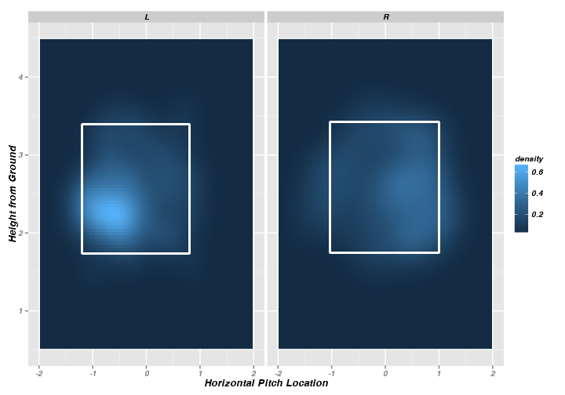
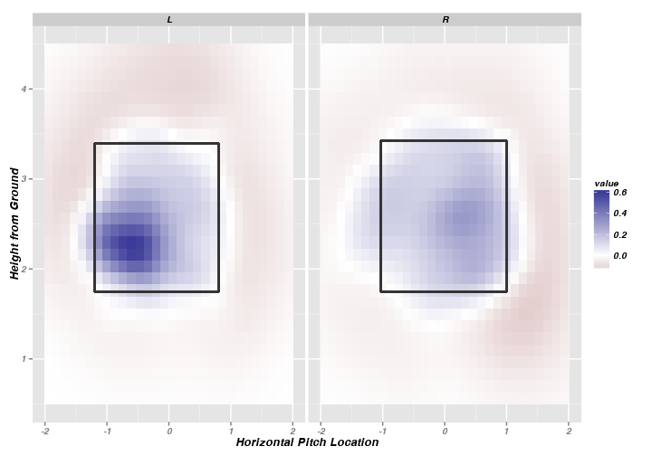
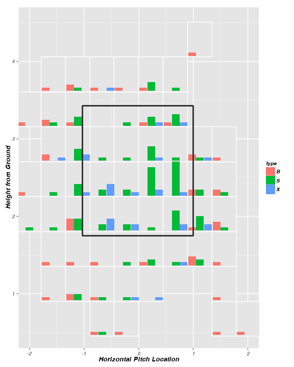
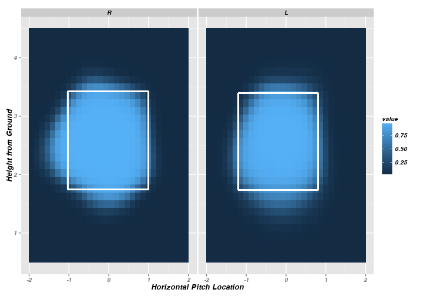

<!--
%\VignetteEngine{knitr}
%\VignetteIndexEntry{A Markdown Vignette with knitr}
-->

Introduction to pitchRx package
====================================

The  [pitchRx package](https://github.com/cpsievert/pitchRx) provides tools for collecting Major League Baseball (MLB) Gameday data and visualizing  [PITCHf/x](http://en.wikipedia.org/wiki/PITCHf/x). This page provides a rough overview of it's scope, but the [RJournal article](http://cpsievert.github.io/pitchRx/RJwrapper.pdf) is more comprehensive. The [source file](https://github.com/cpsievert/cpsievert.github.com/blob/master/pitchRx/index.Rmd) used to generate this page is helpful to see how to embed pitchRx animations in to documents using [knitr](http://yihui.name/knitr/). If coding isn't your thing, you might want to just [play](http://glimmer.rstudio.com/cpsievert/pitchRx/) with my PITCHf/x visualization app!

Data Collection
----------------------------

### Collecting 'smallish' data

**pitchRx** makes it incredibly simple to collect PITCHf/x directly from the source. Here, **pitchRx**'s `scrape` function is used to collect all PITCHf/x data recorded on June 1st, 2013.

<pre class="knitr r">library(pitchRx)
dat &lt;- scrape(start=&quot;2013-06-01&quot;, end=&quot;2013-06-01&quot;)
</pre>

<pre class="knitr r">names(dat)
</pre>

<pre class="knitr r">## [1] "atbat"  "action" "pitch"  "po"     "runner"
</pre>

<pre class="knitr r">dim(dat[[&quot;pitch&quot;]])
</pre>

<pre class="knitr r">## [1] 4682   46
</pre>

By default, `scrape` will return a list of <code class="knitr inline">5</code> data frames. The `'pitch'` data frame contains the actual PITCHf/x data which is recorded on a pitch-by-pitch basis. The dimensions of this data frame indicate that <code class="knitr inline">4682</code> pitches were thrown on June 1st, 2013. If your analysis requires PITCHf/x data over many months, you surely don't want to pull all that data into a single `R` session! For this (and other) reasons, `scrape` can write directly to a database (see the "Managing PITCHf/x data" section). 

### Collecting data by Gameday IDs

In the previous example, `scrape` actually determines the relevant game IDs based on the `start` and `end` date. If the user wants a more complicated query based to specific games, relevant game IDs can be passed to the `game.ids` argument using the built in `gids` data object. 

<pre class="knitr r">data(gids, package=&quot;pitchRx&quot;)
head(gids)
</pre>

<pre class="knitr r">## [1] "gid_2008_02_26_fanbbc_phimlb_1" "gid_2008_02_26_flsbbc_detmlb_1"
## [3] "gid_2008_02_26_umibbc_flomlb_1" "gid_2008_02_26_umwbbc_nynmlb_1"
## [5] "gid_2008_02_27_cinmlb_phimlb_1" "gid_2008_02_27_colmlb_chamlb_1"
</pre>

As you can see, the `gids` object contains game IDs and those IDs contain relevant dates as well as abbreviations for the home and away team name. Since the away team is always listed first, we could do the following to collect PITCHf/x data from every away game played by the Minnesota Twins in July of 2013.

<pre class="knitr r">MNaway13 &lt;- gids[grep(&quot;2013_06_[0-9]{2}_minmlb*&quot;, gids)]
dat2 &lt;- scrape(game.ids=MNaway13)
</pre>

### Managing PITCHf/x data in bulk

Creating and maintaining a PITCHf/x database is a breeze with **pitchRx** and [dplyr](http://cran.r-project.org/web/packages/dplyr/index.html). With a few lines of code (and some patience), all available PITCHf/x data can be obtained directly from its source and stored in a local [SQLite](http://www.sqlite.org/) database:

<pre class="knitr r">library(dplyr)
db &lt;- src_sqlite(&quot;pitchfx.sqlite3&quot;, create=TRUE)
scrape(start=&quot;2008-01-01&quot;, end=Sys.Date(), connect=db$con)
</pre>

The website which hosts PITCHf/x data hosts a wealth of other data that might come in handy for PITCHf/x analysis. The file type which contains PITCHf/x always ends with [inning/inning_all.xml](http://gd2.mlb.com/components/game/mlb/year_2012/month_05/day_01/gid_2012_05_01_arimlb_wasmlb_1/inning/inning_all.xml). `scrape` also has support to collect data from three other types of files: [miniscoreboard.xml](http://gd2.mlb.com/components/game/mlb/year_2012/month_05/day_01/miniscoreboard.xml), [players.xml](http://gd2.mlb.com/components/game/mlb/year_2012/month_05/day_01/gid_2012_05_01_arimlb_wasmlb_1/players.xml), and [inning/inning_hit.xml](http://gd2.mlb.com/components/game/mlb/year_2012/month_05/day_01/gid_2012_05_01_arimlb_wasmlb_1/inning/inning_hit.xml). Data from these files can easily be added to our existing PITCHf/x database:

<pre class="knitr r">files &lt;- c(&quot;miniscoreboard.xml&quot;, &quot;players.xml&quot;, &quot;inning/inning_hit.xml&quot;)
scrape(start=&quot;2008-01-01&quot;, end=Sys.Date(), suffix=files, connect=db$con)
</pre>

### Building your own custom scraper

pitchRx is built on top of the R package [XML2R](http://cran.r-project.org/web/packages/XML2R/index.html). **XML2R** reduces the effort required to organize relational XML content into a collection tables. For this reason, **XML2R** can be useful for building a custom XML scraper. If the reader wants to build their own Gameday scraper, the `pitchRx::makeUrls` function in conjunction with **XML2R** can be very helpful. For a more detailed look at **XML2R**, see the [introductory webpage](http://cpsievert.github.io/XML2R/) and/or the [RJournal paper](http://cpsievert.github.io/pitchRx/RJwrapper.pdf). 

PITCHf/x Visualization
--------------------

### 2D animation

The **pitchRx** comes pre-packaged with a `pitches` data frame with four-seam and cut fastballs thrown by Mariano Rivera and Phil Hughes during the 2011 season. These pitches are used to demonstrate PITCHf/x animations using `animateFX`. The viewer should notice that as the animation progresses, pitches coming closer to them (that is, imagine you are the umpire/catcher - watching the pitcher throw directly at you). In the animation below, the horizontal and vertical location of `pitches` is plotted every tenth of a second until they reach home plate (in real time). Since looking at animations in real time can be painful, this animation delays the time between each frame to a half a second.

<pre class="knitr r">animateFX(pitches, layer=list(facet_grid(pitcher_name~stand, labeller = label_both), theme_bw(), coord_equal()))
</pre>

 <embed width="864" height="864" name="plugin" src="figure/ani.swf" type="application/x-shockwave-flash"> 

To avoid a cluttered animation, the `avg.by` option averages the trajectory for each unique value of the variable supplied to `avg.by`.

<pre class="knitr r">animateFX(pitches, avg.by=&quot;pitch_types&quot;, layer=list(facet_grid(pitcher_name~stand, labeller = label_both), theme_bw(), coord_equal()))
</pre>

 <embed width="864" height="864" name="plugin" src="figure/ani2.swf" type="application/x-shockwave-flash"> 

Note that when using `animateFX`, the user may want to wrap the expression with `animation::saveHTML` to view the result in a web browser. If you want to include the animation in a document, [knitr](http://yihui.name/knitr/options#chunk_options)'s `fig.show="animate"` chunk option can be very useful. 

### Interactive 3D plots

**pitchRx** also makes use of **rgl** graphics. If I want a more revealing look as Mariano Rivera's pitches, I can subset the `pitches` data frame accordingly. Note that the plot below is interactive, so make sure you have JavaScript & [WebGL](http://get.webgl.org/) enabled (if you do, go ahead - click and drag)!

<pre class="knitr r">Rivera &lt;- subset(pitches, pitcher_name==&quot;Mariano Rivera&quot;)
interactiveFX(Rivera)
</pre>

<iframe src="http://cpsievert.github.io/pitchRx/rgl1/" height="600" width="1200"></iframe>

### Strike-zones

#### Raw strike-zone densities

Strike-zones capture pitch locations at the moment they cross the plate. `strikeFX`'s default functionality is to plot the *raw density*. Here is the density of called strikes thrown by Rivera and Hughes in 2011 (for both right and left-handed batters).

<pre class="knitr r">strikes &lt;- subset(pitches, des == &quot;Called Strike&quot;)
strikeFX(strikes, geom=&quot;tile&quot;, layer=facet_grid(.~stand))
</pre>

`strikeFX` allows one to easily manipulate the density of interest through two parameters: `density1` and `density2`. If these densities are identical, the density is defined accordingly. This is useful for avoiding repetitive subsetting of data frames. For example, one could use the following to also generate the density of called strikes shown previously.

<pre class="knitr r">strikeFX(pitches, geom=&quot;tile&quot;, density1=list(des=&quot;Called Strike&quot;), density2=list(des=&quot;Called Strike&quot;), layer=facet_grid(.~stand))
</pre>

If you specify two different densities, `strikeFX` will plot differenced densities. In this case, we are subtracting the "Ball" density from the previous "Called Strike" density.

<pre class="knitr r">strikeFX(pitches, geom=&quot;tile&quot;, density1=list(des=&quot;Called Strike&quot;), density2=list(des=&quot;Ball&quot;), layer=facet_grid(.~stand))
</pre>

`strikeFX` also has the capability to plot tiled bar charts via the option `geom="subplot2d"`. Each grid (or sub-region) of the plot below has a distribution of outcomes among Rivera's pitches to right handed batters. The three outcomes are "S" for strike, "X" for a ball hit into play and "B" for a ball. 

<pre class="knitr r">Rivera.R &lt;- subset(Rivera, stand==&quot;R&quot;)
strikeFX(Rivera.R, geom=&quot;subplot2d&quot;, fill=&quot;type&quot;)
</pre>

#### Probabilistic strike-zone densities

Perhaps more interesting than raw strike-zone densities are probabilistic densities. These densities represent the probability of a certain event happening at a given location. A popular method for fitting such models is Generalized Additive Models. Here we use the **mgcv** library to fit such a model (which automatically chooses a proper tuning parameter via cross-validation).

<pre class="knitr r">noswing &lt;- subset(pitches, des %in% c(&quot;Ball&quot;, &quot;Called Strike&quot;))
noswing$strike &lt;- as.numeric(noswing$des %in% &quot;Called Strike&quot;)
library(mgcv)
m1 &lt;- bam(strike ~ s(px, pz, by=factor(stand)) +
          factor(stand), data=noswing, family = binomial(link='logit'))
strikeFX(noswing, model=m1, layer=facet_grid(.~stand))
</pre>

### Session Info

In the spirit of reproducible research, here is the `sessionInfo` used when creating this document:

<pre class="knitr r">sessionInfo()
</pre>

<pre class="knitr r">## R version 3.0.2 (2013-09-25)
## Platform: x86_64-apple-darwin10.8.0 (64-bit)
## 
## locale:
## [1] en_US.UTF-8/en_US.UTF-8/en_US.UTF-8/C/en_US.UTF-8/en_US.UTF-8
## 
## attached base packages:
## [1] stats     graphics  grDevices utils     datasets  methods   base     
## 
## other attached packages:
## [1] mgcv_1.7-28       nlme_3.1-113      ggsubplot_0.3.2   pitchRx_1.0      
## [5] ggplot2_0.9.3.1   devtools_1.4.1.99 knitr_1.5        
## 
## loaded via a namespace (and not attached):
##  [1] Cairo_1.5-5        colorspace_1.2-4   dichromat_2.0-0   
##  [4] digest_0.6.4       evaluate_0.5.1     formatR_0.10      
##  [7] grid_3.0.2         gtable_0.1.2       hexbin_1.26.3     
## [10] highr_0.3          httr_0.2           labeling_0.2      
## [13] lattice_0.20-24    lubridate_1.3.3    MASS_7.3-29       
## [16] Matrix_1.1-2       memoise_0.1        munsell_0.4.2     
## [19] parallel_3.0.2     plyr_1.8           proto_0.3-10      
## [22] RColorBrewer_1.0-5 RCurl_1.95-4.1     reshape2_1.2.2    
## [25] rgl_0.93.996       scales_0.2.3       stringr_0.6.2     
## [28] tools_3.0.2        whisker_0.3-2      XML_3.95-0.2      
## [31] XML2R_0.0.4
</pre>

