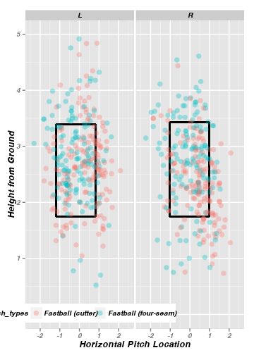
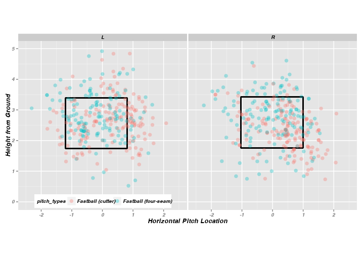
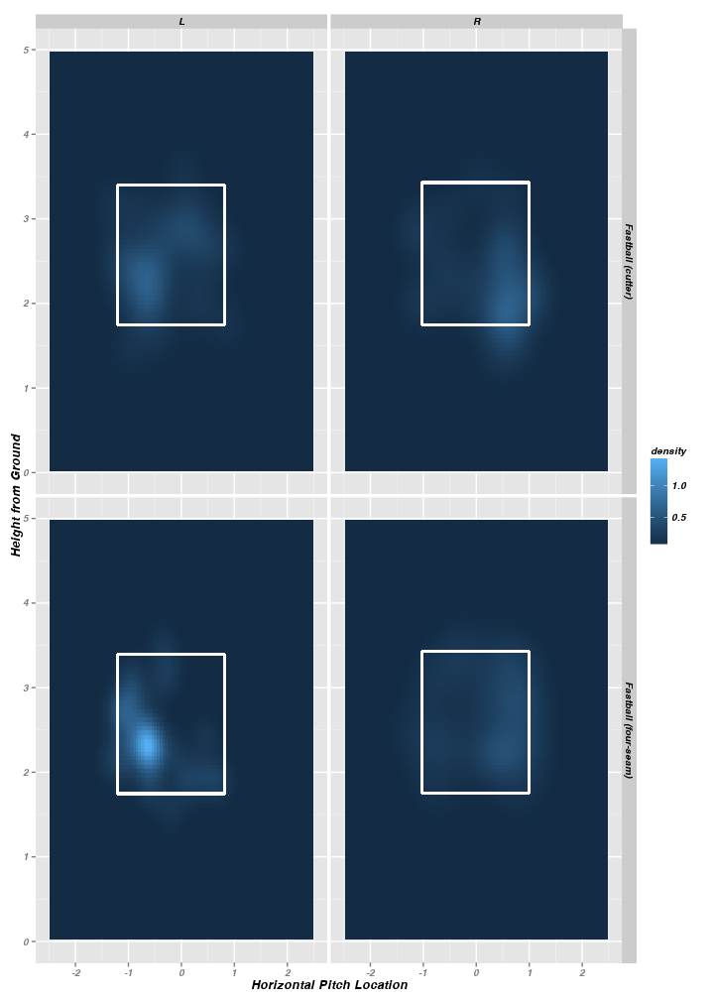

Introduction to pitchRx package
=======================================

<!--browseURL(paste0('http://127.0.0.1:', tools:::httpdPort, '/library/pitchRx/doc/index.html'))>


Introduction
------------

The  **pitchRx** package provides tools for collecting and visualizing Major League Baseball (MLB) PITCHf/x data.


Data Collection
----------------------------

### Collecting PITCHf/x Data

**pitchRx** makes it easy to collect PITCHf/x data directly from the source. Since its establishment in 2008, Major League Baseball Advanced Media (MLBAM) has made PITCHf/x data available in XML format.  MLBAM provides this service for free. To keep it that way, please be mindful when using this library to query their website.

One should collect PITCHf/x on a yearly basis (or shorter - since this is large amount of data). After storing your data appropriately, the collection process can then be repeated for subsequent years (or other timelines).


```r
data <- scrapeFX(start = "2011-01-01", end = "2011-12-31")
# RMySQL is preferred for data storage
library(RMySQL)
drv <- dbDriver("MySQL")
MLB <- dbConnect(drv, user = "your_user_name", password = "your_password", port = your_port, 
    dbname = "your_database_name", host = "your_host")
dbWriteTable(MLB, value = data$pitch, name = "pitch", row.names = FALSE, append = TRUE)
dbWriteTable(MLB, value = data$atbat, name = "atbat", row.names = FALSE, append = TRUE)
rm(data)  #clear workspace so you can repeat for other year(s)
```


If you are storing data via MySQL, you may want to append to these <a href="https://github.com/cpsievert/pitchFX/blob/master/tables.sql">table formats</a>. By default, two data frames are returned. One contains data on the 'pitch' level and the other on the 'atbat' level. If you're interested in having a deeper level of information at your disposal. You can scrape for other data to supplement the core PITCHf/x tables.


```r
data <- scrapeFX(start = "2011-01-01", end = "2011-12-31", tables = list(atbat = fields$atbat, 
    pitch = fields$pitch, game = fields$game, player = fields$player, runner = NULL, 
    umpire = NULL, coach = NULL))
```


No matter how you're storing your data, you will want to join the 'atbat' and 'pitch' table at some point. If you're interested in a subset of data, consider subsetting the 'atbat' table before joining with pitches. For instance, if want all 'four-seam' and 'cutting' fastballs thrown by Mariano Rivera nad Phil Hughes during the 2011 season:


```r
names <- c("Mariano Rivera", "Phil Hughes")
atbats <- subset(data$atbat, pitcher_name == name)
pitchFX <- join(atbats, data$pitch, by = c("num", "url"), type = "inner")
pitches <- subset(pitchFX, pitch_type == c("FF", "FC"))
```


If you're storing your data with MySQL, you could save a bit of time with the following. Note that you want to add criteria for the year of interest (if you have multiple years in your database).


```r
Rivera <- dbGetQuery(MLB, "SELECT * FROM atbat INNER JOIN pitch ON (atbat.num = pitch.num AND atbat.url = pitch.url) WHERE atbat.pitcher_name = 'Mariano Rivera' or atbat.pitcher_name = 'Phil Hughes'")
```


### Collecting XML data

**pitchRx** has convenient functionality for extracting XML data from multiple files into appropriate data frame(s). One has to simply create the XML file names and specify XML nodes/attributes of interest. Keeping with the baseball theme, we can extract various statistics for batters entering a particular game.


```r
data(urls)
dir <- gsub("players.xml", "batters/", urls$url_player[1000])
doc <- htmlParse(dir)
nodes <- getNodeSet(doc, "//a")
values <- gsub(" ", "", sapply(nodes, xmlValue))
ids <- values[grep("[0-9]+", values)]
filenames <- paste(dir, ids, sep = "")
stats <- urlsToDataFrame(filenames, tables = list(Player = NULL), add.children = TRUE)
```


PITCHf/x Visualization
--------------------

### Animation

I can use the `pitches` data frame created in the previous section to animate pitch trajectories.


```r
animateFX(pitches, point.size = 5)
```

<div align = "center">
 <embed width="360" height="504" name="plugin" src="figure/ani.swf" type="application/x-shockwave-flash"> 
</div>


The plotting options for **pitchRx** encompass the flexibility and syntax of the ggplot2 grammar of graphics.


```r
animateFX(pitches, point.size = 5, layer = facet_grid(pitcher_name ~ stand, 
    labeller = label_both))
```

<div align = "center">
 <embed width="720" height="1008" name="plugin" src="figure/ani2.swf" type="application/x-shockwave-flash"> 
</div>


### Strikezone Densities

I can also examine static pitch locations at the moment they cross the plate.


```r
strikeFX(pitches, layer = facet_grid(. ~ stand))
```

 


Unlike `animateFX`, `strikeFX` allows different geometries.


```r
strikeFX(pitches, geom = "tile", contour = TRUE, layer = facet_grid(pitch_types ~ 
    stand))
```

 


`strikeFX` allows one to easily manipulate the density of interest through two parameters: `density1` and `density2`. If these densities are identical, the density is defined accordingly. This is useful for avoiding repeative subsetting of data frames. For example, say I want the density of 'Called Strikes'.


```r
strikeFX(pitches, geom = "tile", density1 = list(des = "Called Strike"), density2 = list(des = "Called Strike"), 
    layer = facet_grid(pitch_types ~ stand))
```

 


If you specify two different densities, `strikeFX` will plot differenced bivariate density estimates. In this case, we are subtracting the "Ball" density from the previous "Called Strike" density.


```r
strikeFX(pitches, geom = "hex", density1 = list(des = "Called Strike"), density2 = list(des = "Ball"), 
    layer = facet_grid(pitch_types ~ stand))
```

 


